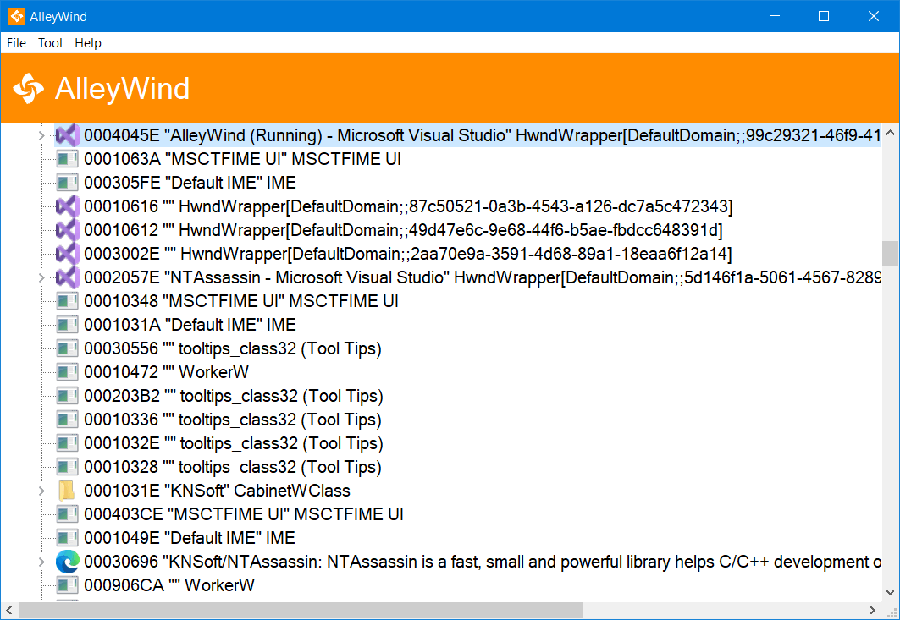
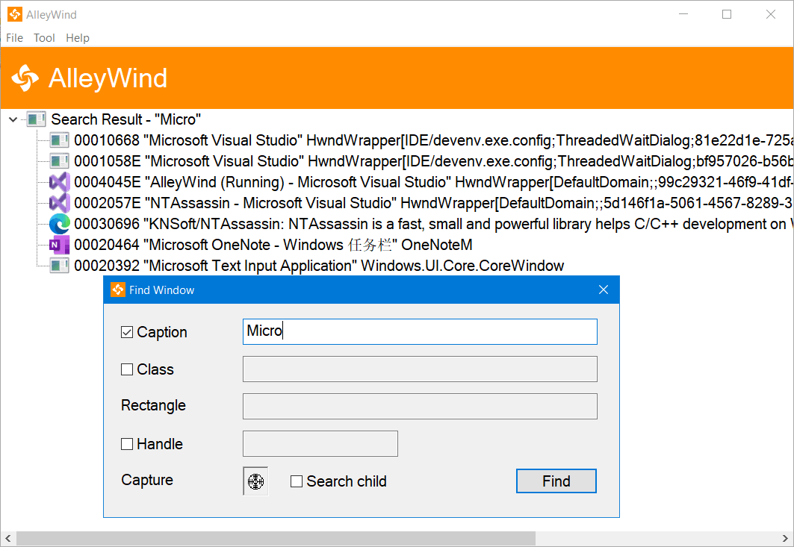
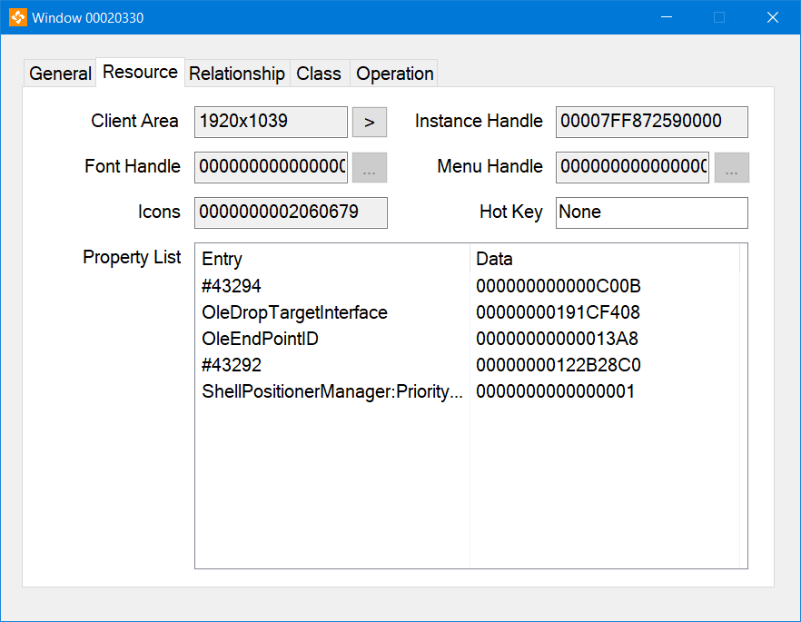
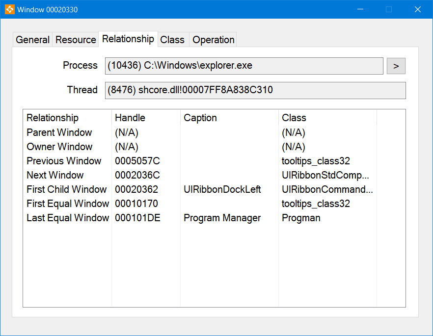
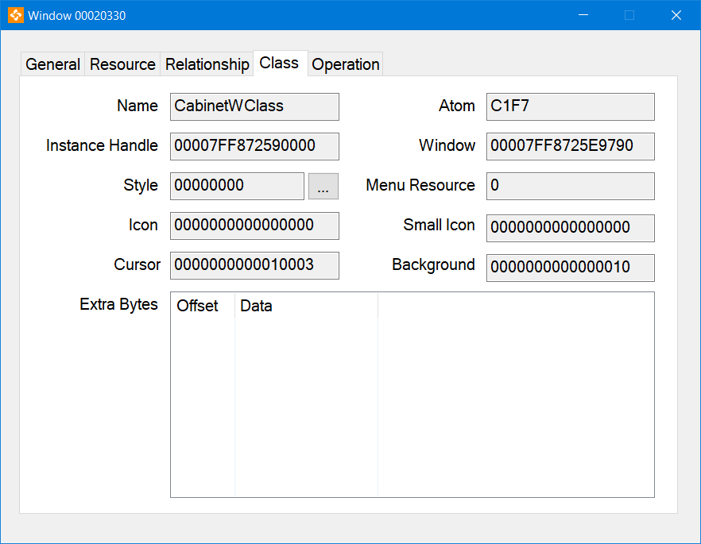
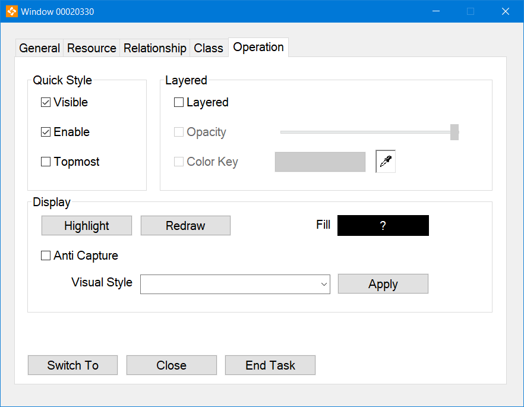

# V2 is working in progress! ~10%
In [Dev_V2 branch](https://github.com/KNSoft/AlleyWind/tree/Dev_V2), with overall improvement:
- UIAccess support
- Improved DPI scaling
- More features
  - Support "Always On Top"
  - ...
- ...

# AlleyWind
AlleyWind is an advanced Win32-based and open-source utility manages windows running on system. Likes ``Spy++`` but provides more features, especially modify properties of window.

AlleyWind could:
+ Displays a graphical tree of relationships among windows, and search what you want
+ Shows the properties of selected window(s), and some of them could be modified:
    + Text, Font, Position, Size, Style, Extended Style and Class Style
    + Visibility, Availability, and Topmost property
    + Hot Key, Visual Style, Display Affinity and Layered properties
+ Shows private properties (e.g., address of window or dialog callback procedure) by using code injection technology
+ Supports multiple languages, multiple monitors and High-DPI

## Snapshots

Main Window: display tree view for current system windows with icons
 
 

Window Finder (Tool - Find Window): search window by name or class, or use window capture tool select window by mouse
 
 

Window properties - General Tab: window basic properties
 
 

Window properties - Resource Tab: window resource
 
 

Window properties - Relationship Tab: window relationship to process, thread and other windows
 
 

Window properties - Class Tab: window class
 
 

Window properties - Operation Tab: operations for window