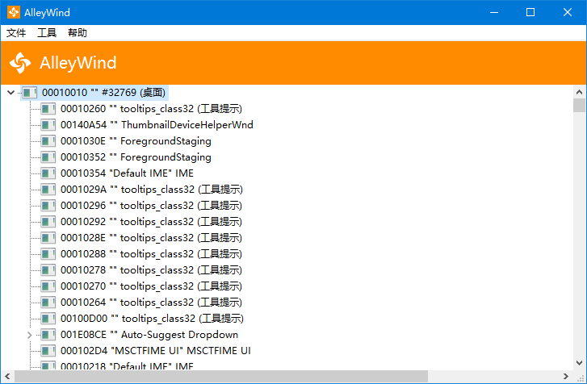
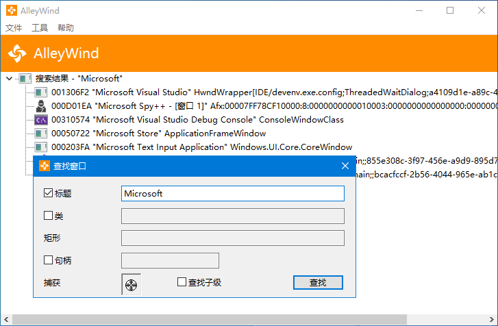
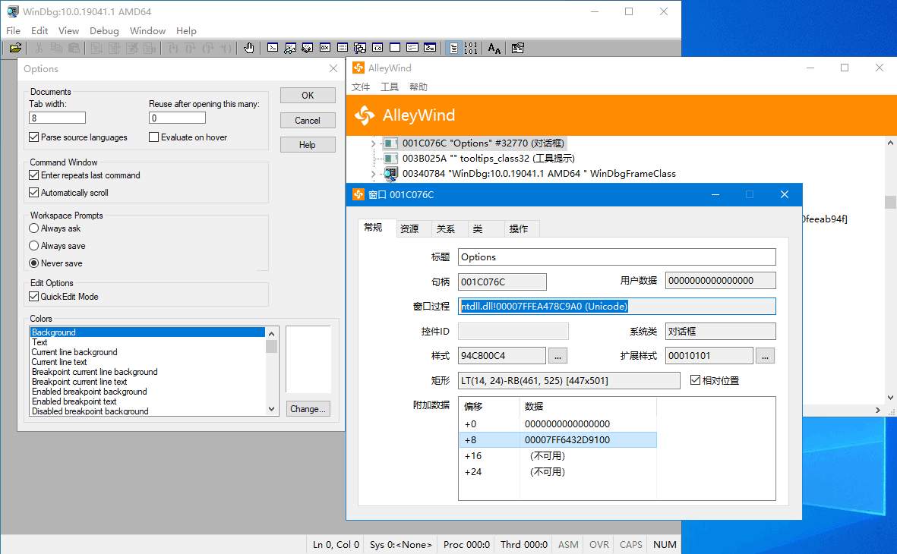

# AlleyWind
AlleyWind is an advanced Win32-based and open-sourced utility that helps you to manage system's windows. AlleyWind could:
+ Displays a graphical tree of relationships among windows, and search what you want
+ Shows the properties of selected window(s), and some of them could be modified:
    + Text, Font, Position, Size, Style, Extended Style and Class Style
    + Visibility, Availability, and Topmost property
    + Hot Key, Visual Style, Display Affinity and Layered properties
+ Obtains private properties (e.g., address of window or dialog callback procedure) by using code injection technology
+ Supports multiple languages, multiple monitors and High-DPI

## Homepage
\>\>\> Click our homepage [KNSoft.org](https://knsoft.org) for more information! <<<

## Topic
[看雪论坛](https://bbs.pediy.com/)：[[原创]AlleyWind - 专业窗口管理工具](https://bbs.pediy.com/thread-266706.htm)

## Latest Version
AlleyWind V1.0.2.0 Beta [2021-06-14]

*This is Beta version for testing only, which is not stable! SHOULD NOT BE USED IN IMPORTANT ENVIRONMENT!

## Snapshots

